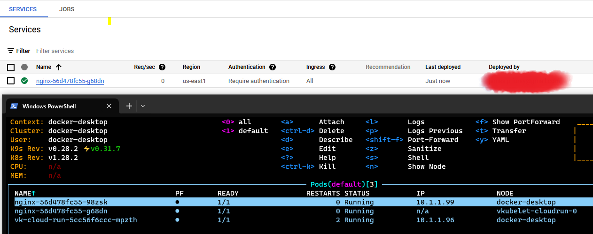

# Virtual Kubelet  - Cloud run
A virtual kubelet implementation for Google CloudRun

## Kubernetes Virtual Kubelet with Cloud Run
The Google Cloud Run provider for the Virtual Kubelet configures Google Cloud Run service as a virtual node in a Kubernetes cluster. Hence, pods scheduled on the virtual node can be as Google Cloud Run services. This configuration allows users to take advantage of both the capabilities of Kubernetes and the management value and cost benefit of Cloud Run.

## Current status

Verified to work currently only on Windows using a local Kubernetes instance via Docker Desktop.
Cloudrun permisisons permitted via ADC made avialable to the kubernetes instance via configmap.

This Project can be a considered a POC at best, and is highly unlikely to function outside of the exact  scenario described above



## Features 

Virtual Kubelet's Google Cloud Run provider relies heavily on the feature set that Cloud Run service provides. 

### Supported
* Environment Variables
* More to come

### Limitations (Not supported)
* Anything enforced by Cloud Run
* * [strict resource settings](https://cloud.google.com/run/docs/configuring/services/cpu)
* * 1 ingress 
* 

## Identity

### (Recommended) IAM Workflow Identity

### Application Default Credentials

Follow the guide here to download an a file with your credentials https://cloud.google.com/docs/authentication/application-default-credentials
and install this as a config map in your local Kubernetes instance to grant the virtual kubelet access to your Google Cloud run instance
```
kubectl create configmap application-default-credentials --from-file=./application_default_credentials.json
```

## Installation

### Helm

```bash
helm repo add vk-cloud-run https://jimfim.github.io/vk-cloud-run
```


```bash
helm install vk-cloud-run vk-cloud-run/vk-cloud-run
```

or from source
```bash
helm install vk-cloud-run .\charts\vk-cloud-run\
```

### Configuration

#### Node
there is file here that  will allow you to configure the specifications of the Cloud run provider node instance
https://github.com/jimfim/vk-cloud-run/blob/main/src/vkubelet-cfg.json

#### Cloud Run

### Local Docker Desktop
In root directory.

Build local image

``` Bash
docker build -t localhost:5000/virtual-kubelet -f .\Containerfile .
```
Install Virtual Kubelet and Demo app

```bash
helm install vk-cloud-run .\charts\vk-cloud-run\
kubectl apply -f .\charts\deploy.yaml
```
When you are finished, remove install

```bash
helm delete vk-cloud-run
kubectl delete -f .\charts\deploy.yaml
```
### Usage

Add a Toleration to your Deployment

```yaml
      tolerations:
      - key: virtual-kubelet.io/provider
        operator: Exists
```

# Quirks
## Resources 
https://cloud.google.com/run/docs/configuring/services/cpu
